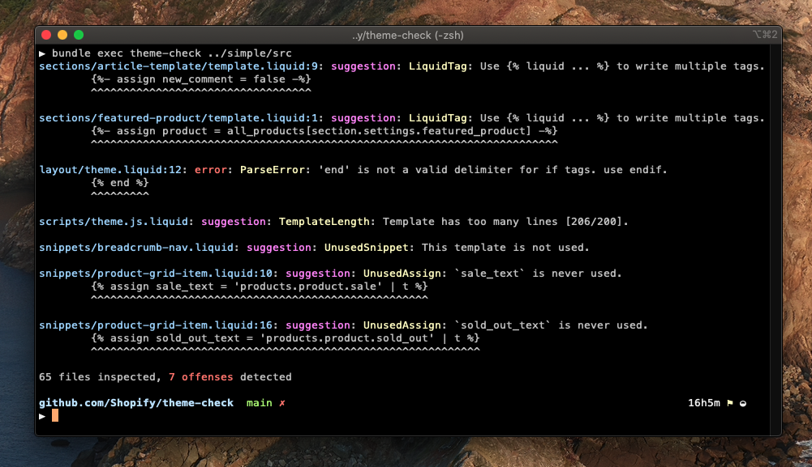

# Theme Check ✅ - A linter for Themes

Think RuboCop, or eslint, but for Shopify themes.

Theme Check is a command line tool that helps you follow Shopify Themes & Liquid best practices by analyzing the Liquid & JSON inside your theme.

Theme Check is also available [inside some code editors](https://github.com/Shopify/theme-check/wiki).



## Supported Checks

Theme Check currently checks for the following:

✅ Liquid syntax errors  
✅ JSON syntax errors  
✅ Missing snippet & section templates  
✅ Unused ``  
✅ Unused snippet templates  
✅ Template length  
✅ Deprecated tags  
✅ Unknown tags  
✅ Unknown filters  
✅ Missing `{{ content_for_* }}` in `theme.liquid`  
✅ Excessive nesting of snippets  
✅ Missing or extra spaces inside `` and `{{ ... }}`  
✅ Missing default locale file  
✅ Unmatching translation keys in locale files  
✅ Using unknown translation keys in `{{ 'missing_key' | t }}`  
✅ Using several `` instead of ``  
✅ Undefined [objects](https://shopify.dev/docs/themes/liquid/reference/objects)  
✅ Deprecated filters  
✅ Missing `theme-check-enable` comment  

As well as checks that prevent easy to spot performance problems:

✅ Use of [parser-blocking](/docs/checks/parser_blocking_javascript.md) JavaScript  
✅ [Use of non-Shopify domains for assets](/docs/checks/remote_asset.md)  
✅ [Missing width and height attributes on `img` tags](/docs/checks/img_width_and_height.md)  
✅ [Too much JavaScript](/docs/checks/asset_size_javascript.md)  
✅ [Too much CSS](/docs/checks/asset_size_css.md)  

For detailed descriptions and configuration options, [take a look at the complete list.](/docs/checks/)

With more to come! Suggestions welcome ([create an issue](https://github.com/Shopify/theme-check/issues)).

## Requirements

- Ruby 2.7+

## Installation

Theme Check is available through Homebrew _or_ RubyGems.

**Homebrew**

You’ll need to run `brew tap` first to add Shopify’s third-party repositories to Homebrew.

```sh
brew tap shopify/shopify
brew install theme-check
```

**RubyGems**

```sh
gem install theme-check
```

## Usage

```
theme-check /path/to/your/theme

# or from /path/to/your/theme
theme-check
```

Run `theme-check --help` to get full usage.

## Configuration

Add a `.theme-check.yml` file at the root of your theme to configure:

```yaml
# If your theme is not using the supported directory structure, provide the root path
# where to find the `templates/`, `sections/`, `snippets/` directories as they would
# be uploaded to Shopify.
root: dist

# It is possible to extend theme-check with custom checks
require:
  - ./path/to/my_custom_check.rb

TemplateLength:
  # Disable some checks
  enabled: false
  # Or configure options
  max_length: 300
  # Or ignore certain paths
  ignore:
    - snippets/icon-*
  # Or change the severity (error|suggestion|style)
  severity: suggestion

# Enable a custom check
MyCustomCheck
  enabled: true
```

See [config/default.yml](config/default.yml) for available options & defaults.

## Disable checks with comments

Use Liquid comments to disable and re-enable all checks for a section of your template:

```liquid
theme-check-disable

theme-check-enable
```

Disable a specific check by including it in the comment:

```liquid
theme-check-disable UnusedAssign

theme-check-enable UnusedAssign
```

Disable multiple checks by including them as a comma-separated list:

```liquid
theme-check-disable UnusedAssign,SpaceInsideBraces

theme-check-enable UnusedAssign,SpaceInsideBraces
```

Disable checks for the _entire document_ by placing the comment on the first line:

```liquid
theme-check-disable SpaceInsideBraces


```

## Exit Code and `--fail-level`

Use the `--fail-level` (default: `error`) flag to configure the exit code of theme-check. Useful in CI scenarios.

Example:

```
# Make CI fail on styles warnings, suggestions, and errors
theme-check --fail-level style path_to_theme

# Make CI fail on suggestions, and errors
theme-check --fail-level suggestion path_to_theme

# Make CI fail on errors
theme-check path_to_theme
```

There are three fail levels:

- `error`
- `suggestion`
- `style`

Exit code meanings:

- 0: Success!
- 1: Your code doesn't pass the checks
- 2: There's a bug in theme-check

If you would like to change the severity of a check, you can do so with the `severity` attribute. Example:

```yaml
DeprecateLazysizes:
  enabled: true
  severity: error
```
