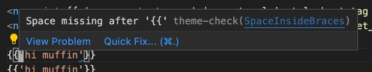
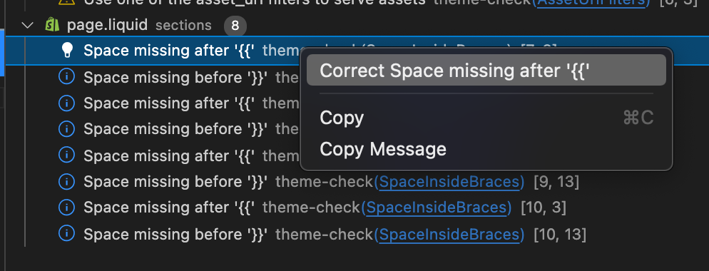
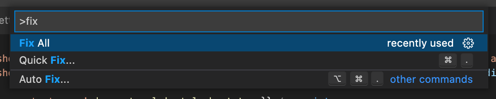
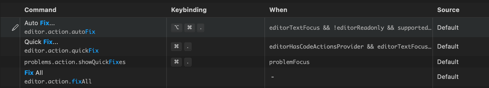

# How to correct code with Code Actions, Commands and Workspace Edits

The [Language Server Protocol (LSP)][lsp] empowers Language Server developers to offer refactorings, quick fixes and the execution of commands to their users. In Theme Check, we take advantage of this to offer quick fixes and autocorrection to users.

This document exists to give you an overview of how that works.

## Overview

It goes like this:

1. The Client (VS Code, vim, etc.) asks the Server for [Code Actions](#code-actions) at a character position, and the server responds with available `quickfix` and `source.fixAll` code actions.
2. The User _may_ select one of the code actions by interacting with the UI (see [visual examples](#code-actions)). The selection triggers the Client to asks the Server to execute a `correction` [Command](#Commands) for certain [Diagnostics](#diagnostic) on behalf of the user.
3. The Server asks the Client to apply a [Workspace Edit](#workspace-edits) to fix the diagnostics.

## Sequence Diagram


<details>
<summary>Sequence Diagram Explanation</summary>

1. The Client asks the Server for [code actions](#code-actions) for the current file and character range.
2. The Server responds with a list of code actions that can be applied for this location and character range. (`quickfix` and `source.fixAll`)
3. ...Wait for user input...
4. The User selects one of the code actions
5. The Client sends a `workspace/executeCommand` request to the Server for this code action.
6. The Server figures out the [workspace edit](#workspace-edits) for the command and arguments.
7. The Server sends a `workspace/applyEdit` request for the file modifications that would fix the diagnostics.
8. The Client responds with the status of the `applyEdit`.
9. The Server cleans up its internal representation of the diagnostics and updates the client with the latest diagnostics.
11. The Server responds to the `workspace/executeCommand` request.

</details>

## What it's like in the code

We handle two Client->Server LSP requests:

1. On `textDocument/codeAction`, our `CodeActionEngine` returns the results obtained from all `CodeActionProvider`.
2. On `workspace/executeCommand`, our `ExecuteCommandEngine` dispatches the command and arguments to appropriate `ExecuteCommandProvider`.

We define providers:

- Two `CodeActionProvider`:
  1. [`QuickFixCodeActionProvider`](/lib/theme_check/language_server/code_action_providers/quickfix_code_action_provider.rb) - This one provides code actions that fix _one_ diagnostic.
  2. [`SourceFixAllCodeActionProvider`](/lib/theme_check/language_server/code_action_providers/source_fix_all_code_action_provider.rb) - This one provides code actions that fix _all diagnostics in the current file_.
- One `ExecuteCommandProvider`:
  1. [`CorrectionExecuteCommandProvider`](/lib/theme_check/language_server/execute_command_providers/correction_execute_command_provider.rb) - This one takes a list of diagnostics as arguments, turns them into a [WorkspaceEdit](#workspace-edit) and tries to apply them with the server->client `workspace/applyEdit` request.

We define a [`DocumentChangeCorrector`](/lib/theme_check/language_server/document_change_corrector.rb) (an LSP analog to our [`Corrector`](/lib/theme_check/corrector.rb) class). This class turns corrector calls into document changes supported by the LSP. For more details, see the [LSP reference on resource changes][lspresourcechange].

## Definitions

### Code Actions

A [CodeAction][lspcodeaction] is the Language Server Protocol construct for "stuff you might want to do on the code."

Think refactoring, running tests, fixing lint errors, etc.

The client figures out which one it can run by executing the client->server `textDocument/codeAction` request.

<details>
<summary>Visual Examples</summary>

In VS Code, code actions of different kinds have special meanings and are mapped to multiple places in the UI.

* `Quick Fix...` button on diagnostic hover

  

* Diagnostic right click in the problems tab

  

* Command palette `Quick Fix...` and `Fix All`

  

* Keyboard shortcuts

  
</details>

<details>
  <summary>TypeScript Interface</summary>

  ```ts
  interface CodeAction {
    title: string; // UI string, human readable for the action
    kind?: CodeActionKind; // OPTIONAL, for filtering
    diagnostics?: Diagnostic[]; // The diagnostics that the action SOLVES.
    isPreferred?: boolean; // Are used by auto fix and can be targetted by keybindings.
    // Shown as faded out in the code action menu when the user request a more specific type of code action
    disabled?: {
      reason: string;
    },

    // if both edit and command are present, edit is run first then command.
    // I think edit is used so the client performs the change, wheras the command
    // would be done by the server
    edit?: WorkspaceEdit; // what this action does ??!!
    command?: Command; // the command that it executes
    data?: any; // sent from the CodeAction to the codeAction/resolve.
  }

  interface Command {
    title: string; // Title of the command, like `save`
    command: string; // id
    arguments?: any[]
  }
  ```
</details>

---

### Commands

A [Command][lspcommand] is the Language Server Protocol representation of a command that can be executed by the Server.

Think of them as data representation of function calls that can be made by the Client.

Typically, a command is associated with a Code Action. If the Client wants to perform this Code Action, it will make a Client->Server `workspace/executeCommand` request.

<details>
  <summary>TypeScript Interface</summary>

  ```ts
  interface Command {
    title: string; // Title of the command, like `save`
    command: string; // id
    arguments?: any[]
  }
  ```
</details>

---

### Workspace Edits

A [WorkspaceEdit][lspworkspaceedit] is the Language Server Protocol construct that abstracts code changes as data.

Think edit file, create file, delete file but as data.

<details>
  <summary>TypeScript Interface</summary>

  ```ts
  interface WorkspaceEdit {
    changes?: { uri: TextEdit[] ];
    documentChanges: (TextDocumentEdit | CreateFile | RenameFile | DeleteFile|)[];
    changeAnnotations?: { [id: string]: ChangeAnnotation }
  }

  // see https://microsoft.github.io/language-server-protocol/specifications/specification-current/#resourceChanges
  interface CreateFile {
    kind: 'create';
    uri: DocumentUri;
    options?: CreateFileOptions;
    annotationId?: ChangeAnnotationIdentifier;
  }

  interface TextEdit {
    range: Range;
    newText: string; // can be empty to delete
  }

  interface TextDocumentEdit {
    textDocument: OptionalVersionedTextDocumentIdentifier;
    edits: (TextEdit | AnnotatedTextEdit)[]
  }

  interface OptionalVersionedTextDocumentIdentifier {
    uri: TextDocumentURI;
    // null is for when the file wasn't open from the client
    // integer is for when you know what it was.
    version: integer | null;
  }
  ```
</details>

---

### Diagnostic

A [Diagnostic][lspdiagnostic] is the Language Server Protocol construct for errors, warnings and information bubbles.

In our case, diagnostics are Theme Check offenses.

They appear in the Problems tab and in the gutter of the editor.

[lsp]: https://microsoft.github.io/language-server-protocol/specification
[lspcodeaction]: https://microsoft.github.io/language-server-protocol/specification#textDocument_codeAction
[lspcommand]: https://microsoft.github.io/language-server-protocol/specification#command
[lspexecutecommand]: https://microsoft.github.io/language-server-protocol/specification#workspace_executeCommand
[lspworkspaceedit]: https://microsoft.github.io/language-server-protocol/specification#workspaceEdit
[lspdiagnostic]: https://microsoft.github.io/language-server-protocol/specifications/specification-3-17/#diagnostic
[lspresourcechange]: https://microsoft.github.io/language-server-protocol/specifications/specification-current/#resourceChanges
